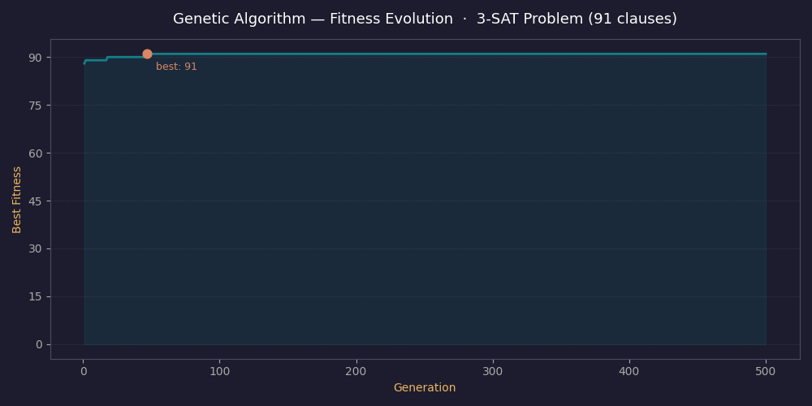

# Genetic Algorithm and SAT Problem

This repository contains a remastered version of a project originally developed for the Artificial Intelligence course at the [University of Guanajuato](https://www.ugto.mx/). The original exercise was part of the optimization unit and asked to implement a genetic algorithm and apply it to solve the Boolean satisfiability problem. The code has been refactored to improve readability, corrected where necessary, and documented more carefully — both as a personal exercise in writing clean scientific code and as a way to leave a useful reference for anyone studying the same topics.

---

## Genetic Algorithm

A **genetic algorithm** (GA) is a population-based metaheuristic inspired by the mechanisms of biological evolution: selection, crossover, and mutation. It belongs to the broader family of evolutionary algorithms and is particularly useful when the search space is large, discontinuous, or poorly understood, making gradient-based or exhaustive methods impractical.

The method was formalized by **John Holland** in the 1970s and later popularized in engineering and combinatorial optimization by **David E. Goldberg**, whose book *Genetic Algorithms in Search, Optimization, and Machine Learning* (1989) became a standard reference.

### How it works

The algorithm operates on a **population** of candidate solutions, each encoded as a binary chromosome of length $L$. At each generation, the following steps take place:

1. **Evaluation.** Every individual is scored by a fitness function $f(x)$ that measures solution quality.

2. **Selection.** Parents are chosen using roulette-wheel (fitness-proportionate) selection:

$$
p_i = \frac{f(x_i)}{\sum_{j=1}^{N} f(x_j)}
$$

   When all fitness values are zero, selection falls back to a uniform distribution to avoid division by zero.

3. **Crossover.** Two parents exchange genetic material at a randomly chosen point $k$, producing two offspring:

$$
\text{child}_1 = [x_a^{(1:k)},\ x_b^{(k+1:L)}], \qquad \text{child}_2 = [x_b^{(1:k)},\ x_a^{(k+1:L)}]
$$

4. **Mutation.** Each gene is flipped independently with probability $\mu$:

$$
x'_{i,j} = \begin{cases} 1 - x_{i,j} & \text{with probability } \mu \\ x_{i,j} & \text{with probability } 1 - \mu \end{cases}
$$

5. **Elitism.** The best individuals from the current generation are carried over unchanged, preventing the loss of strong solutions.

This cycle repeats until a stopping criterion is met — in this implementation, a fixed number of generations.

### Key points

- The GA does **not** guarantee finding the global optimum, but it explores the search space efficiently through guided stochastic search.
- Elitism is critical in practice: without it, a good solution found early can be destroyed by mutation or drift in later generations.
- The algorithm's behavior is sensitive to the choice of population size, mutation rate, crossover probability, and elite size. These are hyperparameters that typically require tuning per problem.
- For combinatorial problems like SAT, the binary chromosome encoding maps naturally to the problem's structure, which simplifies both the representation and the fitness function.

---

## SAT Problem

The **Boolean satisfiability problem** (SAT) asks whether there exists an assignment of truth values to a set of Boolean variables such that a given propositional formula evaluates to true. It is one of the central problems in theoretical computer science: in 1971, **Stephen Cook** proved it was the first NP-complete problem, establishing it as a benchmark for the entire class.

In practice, SAT instances are typically expressed in **conjunctive normal form** (CNF), where the formula is a conjunction of clauses and each clause is a disjunction of literals. A literal is either a variable or its negation. The specific variant studied here is **3-SAT**, where every clause contains exactly three literals — a restriction that preserves NP-completeness.

### Variants and related problems

| Variant | Description |
|---|---|
| 2-SAT | Every clause has exactly 2 literals. Solvable in polynomial time. |
| 3-SAT | Every clause has exactly 3 literals. NP-complete. |
| MAX-SAT | Maximize the number of satisfied clauses. NP-hard even approximately. |
| Weighted MAX-SAT | Like MAX-SAT but clauses carry weights. |
| UNSAT | Proving a formula has no satisfying assignment. Co-NP-complete. |

### Key points

- SAT solvers have become highly efficient in practice despite worst-case intractability. Modern CDCL-based solvers (like MiniSat or CryptoMiniSat) can handle instances with millions of variables in industrial applications.
- The **phase transition** phenomenon is well documented in random 3-SAT: near a clause-to-variable ratio of approximately 4.27, instances shift abruptly from almost certainly satisfiable to almost certainly unsatisfiable, and the hardest instances cluster around this threshold.
- The benchmark instances used here come from [SATLIB](https://www.cs.ubc.ca/~hoos/SATLIB/benchm.html), a standard repository of SAT benchmarks maintained by the community.

---

## Class Exercise

The original exercise was part of the optimization unit in the AI course. The instructions (shown in the academic material) asked to:

- Download any instance from the **Uniform Random 3-SAT** section of SATLIB.
- Load the CNF file into a matrix with 3 columns (one per literal) and as many rows as there are clauses. For example, the filename `uf20-91` indicates 20 variables and 91 clauses. Each cell stores the literal index, using a negative sign to represent negation.
- Define the **fitness function** as the count of satisfied clauses for a given candidate assignment, rather than a simple binary satisfy/not-satisfy score. This makes the problem a maximization task and gives the GA a meaningful gradient to follow.
- Report the best solution found and its fitness value.

The implementation in [`src/sat_problem.py`](src/sat_problem.py) follows this specification directly. It reads any CNF file from the [`data/`](data/) directory, constructs the fitness function from the clause matrix, and passes it to the same GA framework used for the OneMax reference problem in [`src/genetic_algorithm.py`](src/genetic_algorithm.py).

---

## Results

The experiment was run on the instance [`data/uf20-0190.cnf`](data/uf20-0190.cnf), which contains **20 variables** and **91 clauses**.

```
Selected file: data/uf20-0190.cnf
Chromosome length: 20
Clauses shape: 91 x 3

Clauses sample:
[[  6  10  14]
 [ -3 -12   4]
 [ 19  -4 -15]
 [-20  -2  -5]
 [ 12 -10   6]]

Best fitness: 91 / 91
Satisfies: 100.0%
Best solution: [1 0 0 1 0 0 1 1 0 1 0 1 1 0 1 1 0 1 1 1]
```

The algorithm found a complete satisfying assignment — all 91 clauses satisfied.



The fitness curve shows the GA converging quickly, reaching the maximum at around generation 50 and remaining there for the rest of the run. This is a direct consequence of elitism: once the optimal solution is found, it is preserved.

### Why 100%?

The result is not surprising given the characteristics of this instance:

- **Small search space.** With 20 variables, there are only $2^{20} \approx 10^6$ possible assignments. A population of 200 individuals already samples a meaningful portion of the space from the first generation.
- **Satisfiable by construction.** SATLIB instances are generated with known solutions. The `uf20` family is designed to sit near the phase-transition ratio, making them useful for analysis but not necessarily the hardest cases.
- **Elitism prevents regression.** Once a perfect assignment is found, it cannot be lost in subsequent generations.

This does not mean a GA will always reach 100% on any SAT instance. On unsatisfiable formulas, or on larger instances where the search space grows exponentially, the algorithm may return a partial solution. The satisfaction percentage is defined as:

$$
\text{Satisfaction} = \frac{\text{Best fitness}}{\text{Total clauses}} \times 100
$$

A score below 100% is still informative: it tells how close the best assignment is to a complete solution, which is directly useful in MAX-SAT settings.

---

## Multi-instance evaluation

Running the GA across a set of 30 randomly selected `uf20` instances (all with 20 variables and 91 clauses) produced the following results:

```
Running multiple SAT instances...

 1. data/uf20-0304.cnf • 91/91 (100.0%)
 2. data/uf20-0578.cnf • 91/91 (100.0%)
 3. data/uf20-0642.cnf • 91/91 (100.0%)
 4. data/uf20-0502.cnf • 91/91 (100.0%)
 5. data/uf20-086.cnf • 91/91 (100.0%)
 6. data/uf20-0178.cnf • 91/91 (100.0%)
 7. data/uf20-0745.cnf • 91/91 (100.0%)
 8. data/uf20-0155.cnf • 91/91 (100.0%)
 9. data/uf20-0280.cnf • 91/91 (100.0%)
10. data/uf20-0647.cnf • 91/91 (100.0%)
11. data/uf20-0655.cnf • 91/91 (100.0%)
12. data/uf20-0414.cnf • 91/91 (100.0%)
13. data/uf20-0972.cnf • 91/91 (100.0%)
14. data/uf20-0508.cnf • 91/91 (100.0%)
15. data/uf20-0589.cnf • 91/91 (100.0%)
16. data/uf20-0955.cnf • 91/91 (100.0%)
17. data/uf20-0173.cnf • 91/91 (100.0%)
18. data/uf20-0773.cnf • 91/91 (100.0%)
19. data/uf20-0698.cnf • 91/91 (100.0%)
20. data/uf20-0183.cnf • 91/91 (100.0%)
21. data/uf20-0584.cnf • 91/91 (100.0%)
22. data/uf20-0604.cnf • 91/91 (100.0%)
23. data/uf20-0242.cnf • 91/91 (100.0%)
24. data/uf20-052.cnf • 91/91 (100.0%)
25. data/uf20-0568.cnf • 91/91 (100.0%)
26. data/uf20-0365.cnf • 91/91 (100.0%)
27. data/uf20-0389.cnf • 91/91 (100.0%)
28. data/uf20-0734.cnf • 91/91 (100.0%)
29. data/uf20-0615.cnf • 91/91 (100.0%)
30. data/uf20-0558.cnf • 91/91 (100.0%)

Average satisfaction: 100.00%
Standard deviation: 0.00%
Solved instances: 30 / 30
```

Testing the GA on multiple instances is important to assess its generality and robustness: a single-instance success can be misleading, while a broad sweep over randomly selected benchmarks reveals whether the method consistently finds high-quality assignments, how sensitive it is to instance variability, and whether hyperparameters need retuning for different cases.


## Setup and Usage

The project runs on Python 3.10 or later. No special framework is required beyond NumPy and Matplotlib.

### Clone the repository

```bash
git clone https://github.com/vanstrouble/ga-from-scratch
cd genetic-algorithm-sat
```

### Install dependencies

**macOS (Homebrew):**

```bash
brew install python
pip3 install numpy matplotlib
```

**Linux (apt):**

```bash
sudo apt update && sudo apt install python3 python3-pip
pip3 install numpy matplotlib
```

Alternatively, use a virtual environment to keep things isolated:

```bash
python3 -m venv .venv
source .venv/bin/activate
pip install numpy matplotlib
```

### Run the GA on the SAT problem

```bash
python3 src/sat_problem.py
```

The script will prompt for a CNF file from the `data/` directory, run the genetic algorithm, and display the fitness evolution plot along with the best solution found.

### Run the OneMax reference example

```bash
python3 src/genetic_algorithm.py
```

This runs the GA on the OneMax problem, which is useful for observing the algorithm's behavior in isolation before applying it to a harder instance.

---

## References

- Holland, J. H. (1975). *Adaptation in Natural and Artificial Systems*. University of Michigan Press.
- Goldberg, D. E. (1989). *Genetic Algorithms in Search, Optimization, and Machine Learning*. Addison-Wesley.
- Cook, S. A. (1971). The complexity of theorem-proving procedures. *Proceedings of the 3rd ACM STOC*, 151–158.
- Hoos, H. H., & Stützle, T. (2000). SATLIB: An online resource for research on SAT. *SAT 2000*, 283–292. [satlib.org](https://www.cs.ubc.ca/~hoos/SATLIB/benchm.html)
- Bhattacharjee, A., & Chauhan, P. (2017). Solving the SAT problem using Genetic Algorithm. *Advances in Science, Technology and Engineering Systems Journal*, 2(4), 115–120. https://dx.doi.org/10.25046/aj020416
- Mezard, M., Parisi, G., & Zecchina, R. (2002). Analytic and algorithmic solution of random satisfiability problems. *Science*, 297(5582), 812–815.
