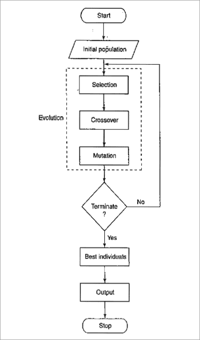

# Genetic Algorithm and SAT Optimization

Project developed for the Artificial Intelligence course at the University of Guanajuato. The original academic exercise has been remastered and polished to improve the code quality, clarify the implementation, and extend its use beyond the initial example. The project is centered on the study of genetic algorithms and their application to combinatorial optimization.

## Genetic Algorithm

A genetic algorithm is a population-based search and optimization method inspired by biological evolution. It belongs to the family of evolutionary algorithms and is commonly used when the solution space is large, discontinuous, or difficult to explore with deterministic methods.

The conceptual foundations of genetic algorithms are usually associated with John Holland, whose work in the 1970s formalized the method in a computational setting. Later, researchers such as David E. Goldberg contributed to its dissemination and practical adoption in engineering and optimization problems.

In the academic material included in this repository, especially the [Genetic Algorithm UG AI UDA presentation](UG_UDA_IA_OPT.pdf), the method is presented as an iterative optimization scheme. A population is initialized as

$$
P^{(0)} = \{x_1^{(0)}, x_2^{(0)}, \dots, x_N^{(0)}\}, \qquad x_i^{(0)} \in \{0,1\}^L,
$$

where $N$ is the population size and $L$ is the chromosome length. The initial generation can be visualized as a random collection of candidate solutions, as illustrated in [docs/A-Simple-Genetic-Algorithm.png](docs/A-Simple-Genetic-Algorithm.png).

<p align="center">
	
</p>

Each chromosome is evaluated by a fitness function $f(x)$, which assigns a numerical value to the quality of a solution. In the implementation provided by [src/genetic_algorithm.py](src/genetic_algorithm.py), selection is performed with roulette-wheel probabilities:

$$
p_i = \frac{f(x_i)}{\sum_{j=1}^{N} f(x_j)}.
$$

When the sum of the fitness values is zero, the selection becomes uniform so that every individual has the same chance of reproduction. After selection, crossover combines two parents. For a one-point crossover at position $k$, the offspring can be written as

$$
\mathrm{child}_1 = [x_a^{(1:k)}, x_b^{(k+1:L)}], \qquad
\mathrm{child}_2 = [x_b^{(1:k)}, x_a^{(k+1:L)}].
$$

Mutation is applied gene by gene with probability $\mu$:

$$
x'_{i,j} =
\begin{cases}
1 - x_{i,j}, & \text{with probability } \mu, \\
x_{i,j}, & \text{with probability } 1-\mu.
\end{cases}
$$

Finally, elitism preserves the best individuals found so far, which prevents the loss of strong solutions between generations. This iterative cycle continues until the stopping criterion is satisfied, which in this repository is defined by the number of generations.

### Psudocode

```text
Input: N, L, f(x), mu, pc, elite_size, generations
Initialize P(0) with N binary chromosomes of length L

for t = 1 to generations:
	Evaluate f(x) for every x in P(t)
	Store the best elite_size individuals
	Select parents with p_i = f(x_i) / sum_j f(x_j)
	Apply one-point crossover with probability pc
	Mutate each gene with probability mu
	Replace the population while preserving the elites

Return the best solution found
```

The mathematical description above follows the same logic used in the pseudocode reference from [UG_UDA_IA_OPT.pdf](UG_UDA_IA_OPT.pdf) and in the implementation of [src/genetic_algorithm.py](src/genetic_algorithm.py). The example provided in the repository uses the OneMax problem as a reference case, which makes the behavior of the algorithm easier to observe and analyze.

## SAT Problem

The SAT problem, or Boolean satisfiability problem, asks whether there exists an assignment of truth values to variables that satisfies a given logical formula. It is one of the most relevant problems in theoretical computer science and computational complexity, since it was the first problem proven NP-complete.

Historically, SAT became a central benchmark for optimization and reasoning methods because of its broad applicability in verification, planning, scheduling, and formal logic. In this repository, the problem is treated from the same evolutionary perspective used for the genetic algorithm, but now the fitness function measures how many clauses of a conjunctive normal form instance are satisfied.

The SAT implementation in [src/sat_problem.py](src/sat_problem.py) reads CNF instances from the [data](data) directory, builds a fitness function from the clauses, and then executes the same genetic algorithm framework to search for satisfying assignments. This makes it possible to compare the optimization behavior of the algorithm across different SAT instances and to study how evolutionary search performs on a classic NP-complete problem.

## SAT Results

The following experiment was obtained by running [src/genetic_algorithm.py](src/genetic_algorithm.py) through [src/sat_problem.py](src/sat_problem.py) on the instance [data/uf20-0190.cnf](data/uf20-0190.cnf). The selected benchmark contains 20 variables and 91 clauses, so the fitness function reaches its maximum value only when all clauses are satisfied.

Results:

```text
Selected file: data/uf20-0190.cnf
Chromosome length: 20
Clauses shape: 91 x 3
Clauses sample:
[[  6  10  14]
 [ -3 -12   4]
 [ 19  -4 -15]
 [-20  -2  -5]
 [ 12 -10   6]]
Best fitness: 91 / 91
Satisfies: 100.0%
Best solution: [1 0 0 1 0 0 1 1 0 1 0 1 1 0 1 1 0 1 1 1]
```

<p align="center">
	
</p>

### Why 100%?

The uf20 instances are relatively easy for a well-implemented genetic algorithm for three main reasons:

1. The search space is small. With 20 variables, the number of possible assignments is $2^{20} = 1{,}048{,}576$, so a population of 200 individuals already samples a meaningful fraction of the space from the first generation.
2. The instances are satisfiable by construction. SATLIB generated these benchmarks with known solutions, and they are located near the phase-transition region, which makes them useful for analysis but not necessarily the hardest cases in the class.
3. The implementation uses elitism. Once the algorithm finds a satisfying assignment, the best solution is preserved, so the optimal fitness is not lost in later generations.

For this reason, the result is perfect because the benchmark instance is satisfiable and the algorithm found an assignment that satisfies every clause. In this setting, the percentage is computed as

$$
\mathrm{Satisfaction} = \frac{\mathrm{Best\ fitness}}{\mathrm{Total\ clauses}} \times 100.
$$

Therefore, when the best fitness equals the total number of clauses, the reported value is 100%. This does not mean that every SAT instance must always yield 100%; it means that for this particular satisfiable instance, the evolutionary search reached a complete satisfying assignment. If the instance were unsatisfiable, or if the search were stopped before convergence, the final percentage could be lower.
